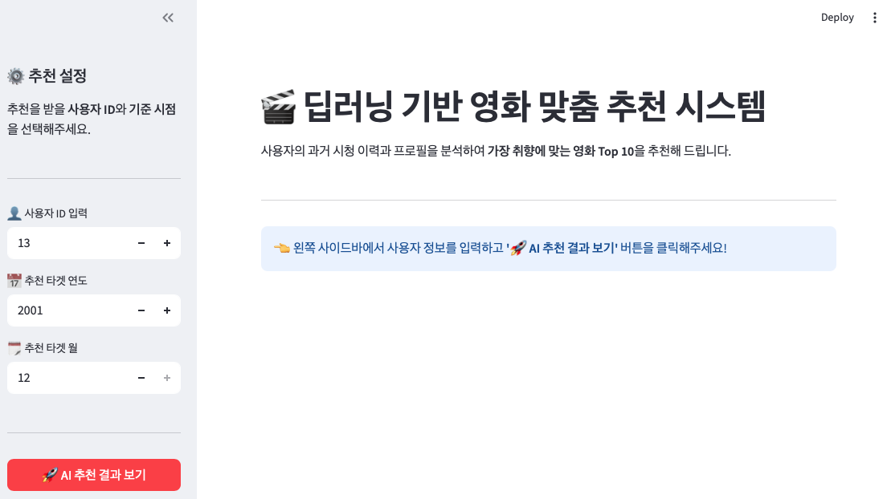
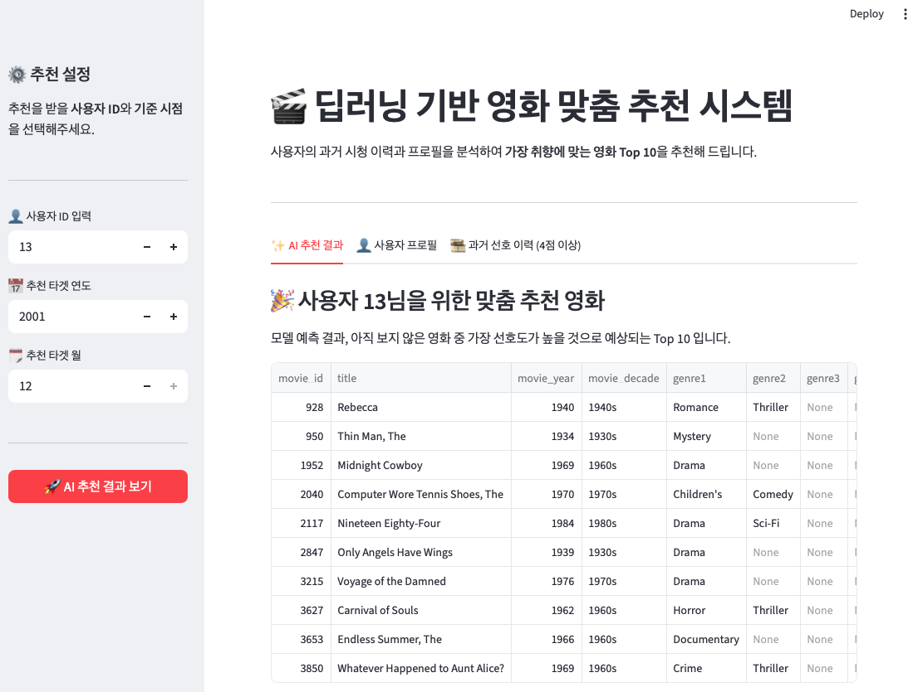
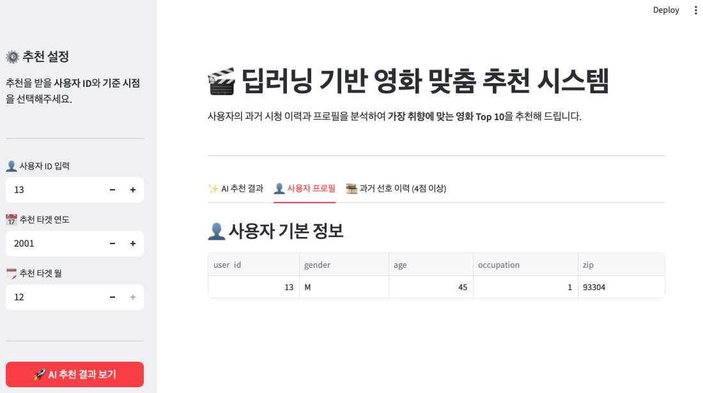
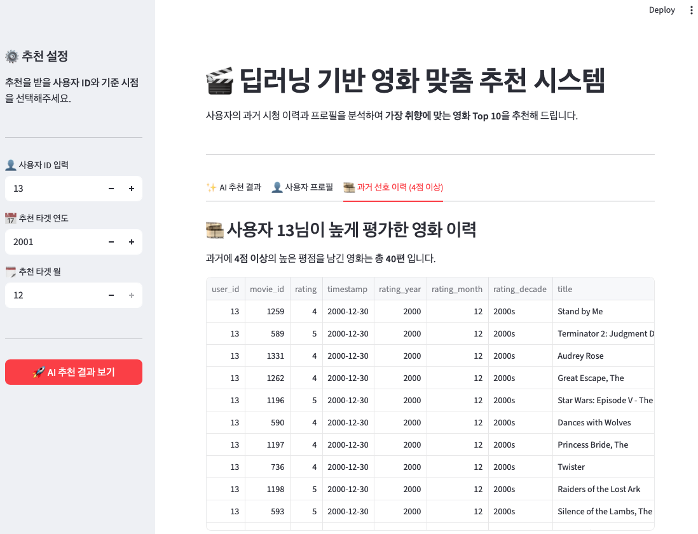

# 작동

초기화면. 세팅값 입력

출력 결과1

출력 결과2

출력 결과3

# 개선

## 1. 활성화함수 ReLU -> Swish 변경

0 근처에서 매끄러운 곡선을 그리며 음수 값도 미세하게 허용. 
신호가 소실되는 Dying ReLU 완화 효과가 있음. 
역전파에서 신호가 끊기지 않고 기울기가 잘 전달됨. 
결과적으로 모델 표현력이 증가하며 예측 정확도가 소폭 상승하는 효과. 
  

## 2. 어텐션 스케일링 추가

Q와 K의 내적 결과값을 임베딩 차원 크기의 제곱근으로 나누는 스케일링 작업. 
스케일링을 안하면 결과값이 너무 커질 수 있고, 
이 상태로 Softmax를 통과하면 분포가 지나치게 쏠리는 문제가 발생할 수 있음. 
스케일링을 통해 모델이 다양한 피처들의 관계를 골고루 학습할 수 있음 
(이게 결국 Scaled Dot-Product Attention임)
  

## 3. 어텐션 드롭아웃 추가

모델이 학습할 때, 앞서 계산한 어텐션 가중치 중 일부를 무작위로 0으로 만듦. 
특정 피처 조합 하나에 과도하게 의존하는 것을 방지함. 
피처를 골고루 학습하기 때문에 처음보는 데이터에도 강해짐. 
(트리 모델에도 비슷한 목적의 기능이 있음 colsample_bytree) 
  

## 4. 배치 정규화 추가

은닉층을 통과할 때마다 데이터 분포가 마음대로 바뀌는 현상을 막아줌. 
층을 통과할 때마다 데이터 평균을 0, 표준편차 1로 정규화 시키고 
학습 가능한 파라미터(Scale&Shift)를 적용해 모델에 맞는 최적 분포로 다시 조정함. 
데이터가 분포가 안정된 상태로 전달되기 때문에 학습이 빠르고 안정적으로 진행됨. 
  
